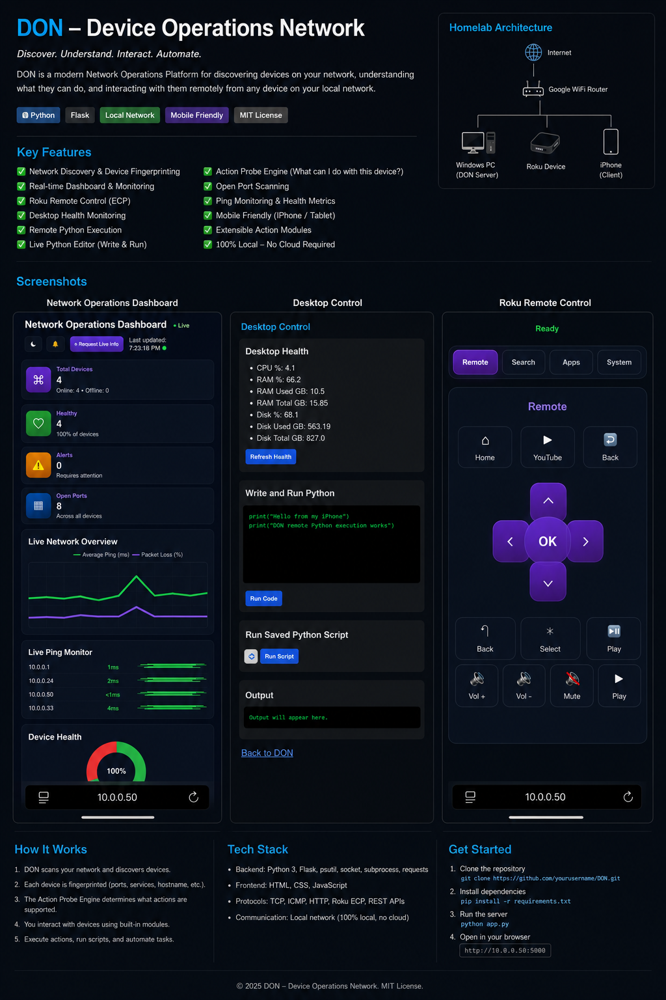
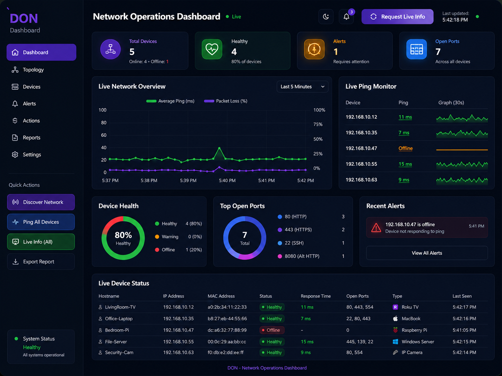
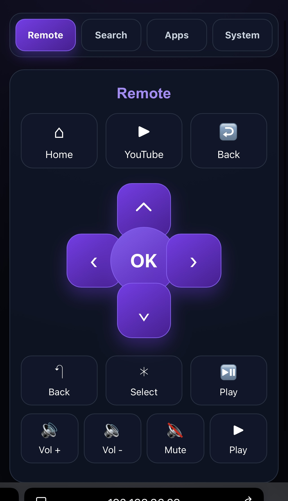
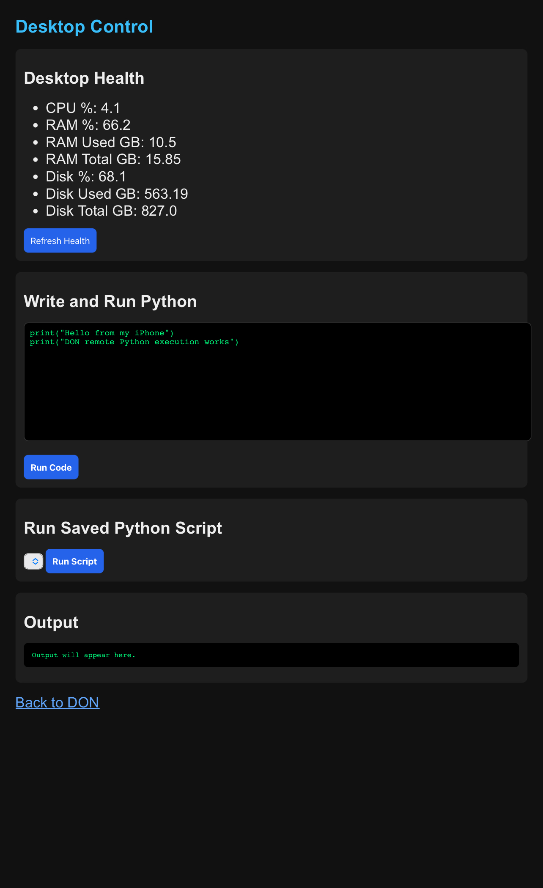

# DON - Device Operations Network

<p align="center">
  
</p>

<p align="center">
<b>Discover • Understand • Interact • Automate</b><br>
A local-first Network Operations Dashboard capable of discovering devices,
fingerprinting services, remotely controlling compatible devices,
and executing automation directly from your iPhone.
</p>

---

# Overview

DON (Device Operations Network) is a Python + Flask based Network Operations Platform built for a personal homelab.

 DON actively discovers devices, determines what they support, and exposes live actions that can interact with them.

Everything runs completely inside the local network.

No cloud.

No external APIs.

Only a Windows PC running DON and devices connected to the same Google WiFi network.

---

# Architecture

```
                Internet
                    │
             Google WiFi Router
                    │
      ┌─────────────┼──────────────┐
      │             │              │
 Windows PC      Roku TV        iPhone
   (DON)                          Browser
```

The Windows PC hosts the DON web server.

The iPhone connects through Safari and becomes a wireless control panel.

---

# Features

## Network Discovery

- Automatic subnet scanning
- Live host discovery
- MAC Address collection
- Hostname detection
- Open Port Scanning
- Device Fingerprinting

---

## Network Dashboard

- Total Devices
- Healthy Devices
- Alerts
- Open Ports
- Live Ping Monitor
- Device Health
- Packet Loss Graph
- Network Overview

<p align="center">

</p>

---

## Roku Remote Controller

Control Roku directly from an iPhone.

Features include

- Home
- Back
- Navigation
- Select
- Volume
- Mute
- Play
- Launch YouTube
- Voice/Text Search
- Long Press Volume

<p align="center">

</p>

Communication uses Roku's External Control Protocol (ECP).

```
HTTP POST

http://ROKU_IP:8060/keypress/Home
http://ROKU_IP:8060/keypress/Back
http://ROKU_IP:8060/keypress/Up
http://ROKU_IP:8060/keypress/VolumeUp
```

---

## Desktop Control

Execute Python scripts remotely from your phone.

Features

- Desktop Health
- CPU Usage
- RAM Usage
- Disk Usage
- Execute Saved Scripts
- Live Python Editor
- Remote Script Execution

<p align="center">

</p>

Example

```python
print("Hello from my iPhone")

for i in range(5):
    print(i)
```

The script is transmitted over WiFi to the Windows PC where DON executes it and immediately streams the output back to the browser.

---

# Action Probe Engine

One of DON's biggest features is automatically determining what actions each discovered device supports.

Instead of only listing devices, DON asks:

> "What can I do with this device?"

Example

| Device | Port | Action |
|---------|------|--------|
| Roku | 8060 | Remote Control |
| Windows PC | 445 | Desktop Control |
| Printer | 80 | Web Interface |
| Camera | 554 | RTSP Stream |
| NAS | 445 | File Management |

The dashboard automatically creates buttons for compatible actions.

---

# Remote Execution Flow

```
iPhone Browser

        │

        ▼

Flask Web Server

        │

        ▼

Desktop Blueprint

        │

        ▼

phone_code.py

        │

        ▼

Python Interpreter

        │

        ▼

Return Output

        │

        ▼

Display Results
```

---

# Project Structure

```
DON/

│

├── app.py

├── README.md

│

├── don/

│   ├── actions.py

│   ├── scanner.py

│   ├── action_probe.py

│   ├── roku.py

│   ├── desktop.py

│   ├── topology.py

│   ├── config.py

│

├── templates/

│   ├── main.html

│   ├── roku.html

│   ├── desktop.html

│   ├── topology.html

│

├── scripts/

│   ├── phone_code.py

│

├── output/

│

└── pics/

    ├── dashboard.png

    ├── desktop.png

    └── roku.png
```

---

# Technologies

Backend

- Python
- Flask
- psutil
- requests
- socket
- subprocess

Frontend

- HTML
- CSS
- JavaScript

Protocols

- TCP
- HTTP
- ICMP
- Roku ECP
- SMB

---

# Current Modules

- Network Scanner
- Dashboard
- Topology Viewer
- Roku Controller
- Desktop Controller
- Remote Python Execution

---

# Planned Modules

## Ubuntu Server

- SSH
- Docker
- CPU Monitoring
- Service Control

---

## NAS

- File Browser
- Storage Health
- Upload
- Download

---

## Cameras

- RTSP Viewer
- Snapshots
- ONVIF

---

## AI Server

- Prompt Submission
- Local LLM
- GPU Monitoring
- AI Job Queue

---

## VMware / Hyper-V

- VM Power
- VM Health
- Snapshot Management

---

## Cisco Devices

- SSH
- Interface Monitoring
- VLAN Viewer
- Configuration Backup

---

# Future Vision

DON is intended to evolve into a complete homelab operations platform capable of managing every device on a local network from a single mobile-friendly dashboard.

Future goals include:

- Real-time WebSocket updates
- Historical metrics database
- Authentication and user accounts
- Plugin architecture
- Automation workflows
- AI-assisted diagnostics
- Multi-site support
- Docker deployment
- Remote notifications
- Voice-controlled automation

---

# Requirements

Python 3.11+

Install dependencies

```bash
pip install flask
pip install psutil
pip install requests
```

---

# Run

```bash
python app.py
```

Open

```
http://YOUR_PC_IP:5000
```

Example

```
http://192.168.20.28:5000
```

Open the same address on your iPhone while connected to the same Google WiFi network.

---

# License

MIT License

---

# Author

**Robert Smith**

DON (Device Operations Network)

Built as a modern homelab platform for discovering, understanding, monitoring, and interacting with devices across a local network from a desktop or mobile browser.
